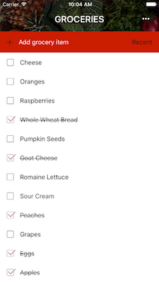
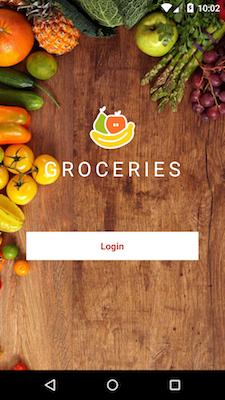
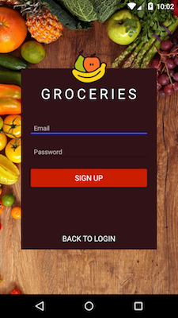
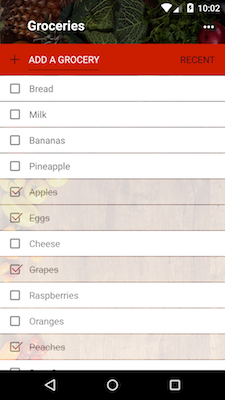

#更改 NatvieScript 的 Open Source - Groceries。
#使用 nativescript-plugin-firebase 串接 Firebase API

串接Firebase:
新增好Firebase資料庫後把產生的google-services.json放置下面路徑
app/App_Resources/Android/google-services.json


<h2 id="screenshots">Screenshots</h2>








<h2 id="development">Development</h2>

This app is built with the NativeScript CLI. Once you have the [CLI installed](http://docs.nativescript.org/angular/tutorial/ng-chapter-1#11-install-nativescript-and-configure-your-environment), start by cloning the repo.

Next, install the app's iOS and Android runtimes, as well as the app's npm dependencies:

```
$ tns install
```

From there you can use the `run` command to run on iOS:

```
$ tns run ios --emulator
```

And the same command to run on Android:

```
$ tns run android --emulator
```

Finally, use the `livesync` command to push out changes to your app without having to go through the full build cycle:

```
$ tns livesync ios --emulator --watch
```
```
$ tns livesync android --emulator --watch
```


